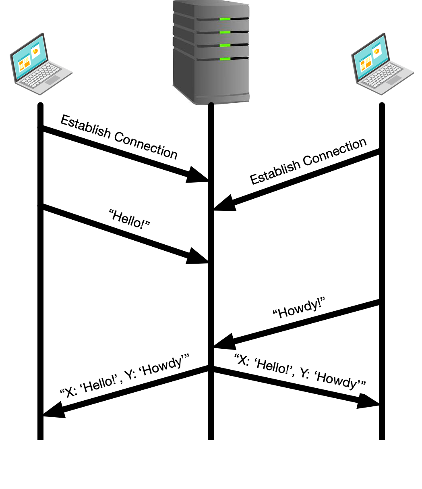
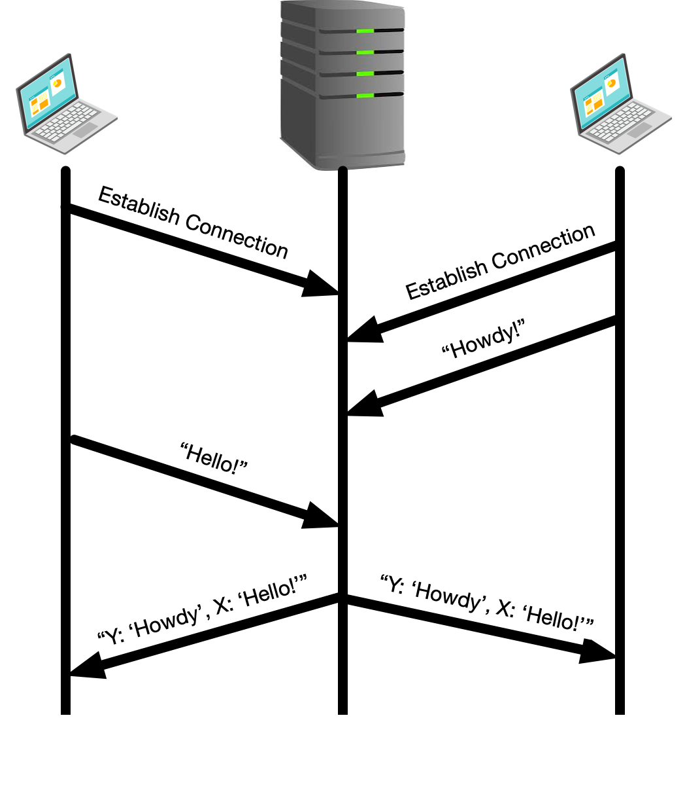
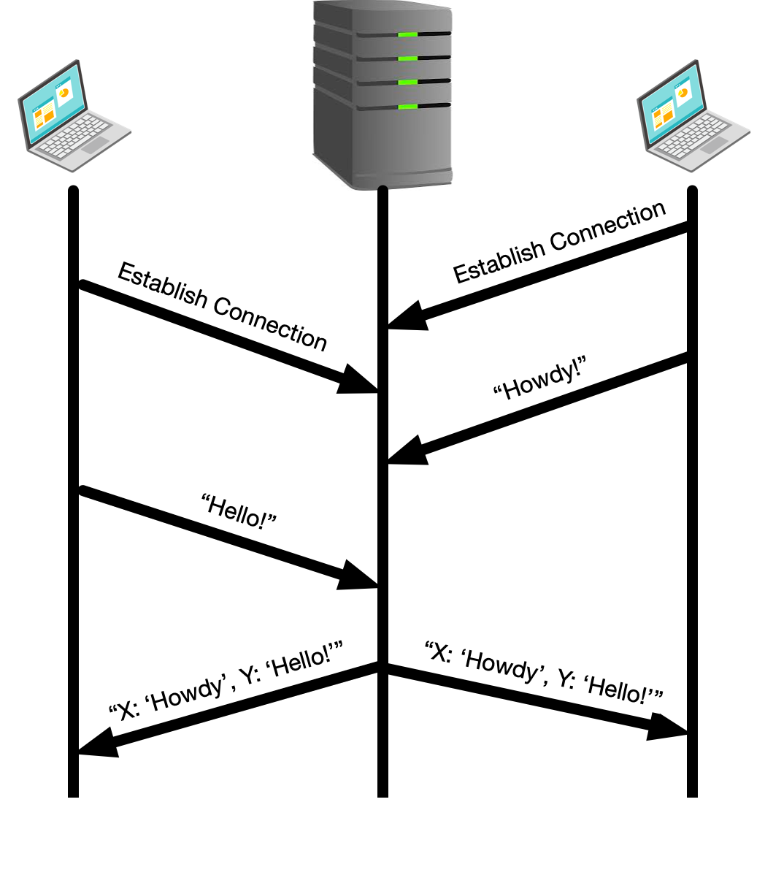
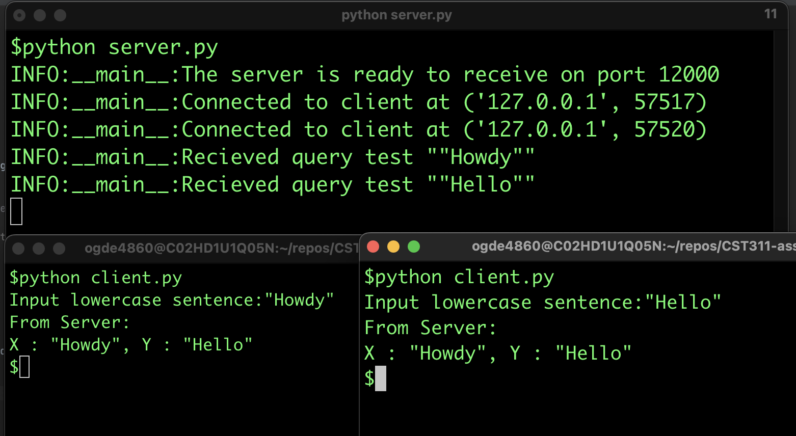

# Programming Assignment 3
## CST 311, Introduction to Computer Networks

READ INSTRUCTIONS CAREFULLY BEFORE YOU START THE ASSIGNMENT.

Assignment must be submitted electronically to [Canvas](https://csumb.instructure.com/) by 11:59 p.m. on the due date.  Late assignments will not be accepted. 
Use the Teams on the Programming Assignment Teams document (also on Canvas under General Information -> Team Information)
Select your Team leader and divide up work per the Programming Process instructions (also on Canvas under General Information > Team Information.)

The assignment requires you to submit both client and server programs. The naming convention of the file should be `PA3_Server_Team<your team #>.py` and `PA3_Client_Team<your team #>.py`.
Additionally, put your names in the program header, where indicated in the `__credits__` variable.
Your client and server programs must meet the requirements below. Your program must have sufficient comments to clearly explain how your code works. Your code must compile to get partial credit.

This assignment is worth 150 points. 

## Purpose

The purpose of this assignment is to satisfy one of the stated outcomes in the syllabus:
- Develop simple software programs using sockets to achieve communication between two (or more) computers.

You will write the program in Python where the interface to the TCP/IP application programming interface is similar to other C-family programming languages.

## Context
The Transmission Control Protocol allows for connection-oriented sessions between clients and a server. This means that multiple clients can connect to a single server and the communication is managed in separate sessions for each client. The initial connection setup is done once and then packets are exchanged until the connection is closed. A common pattern is for a TCP server to start up and allow multiple connections; in fact, this is exactly how HTTP web servers work.
There are an endless number of applications that rely on the kind of communication service that you will develop in this assignment, here are a few examples:
- HTTP web server
- A chat service, such as Google Hangouts or Slack
- Data delivery service, such as the GPS position data in the http://odss.mbari.org backend
Many successful businesses have been built by building rich applications on top of a TCP/IP service such as the one you will create in this assignment.

## Task
Your task is to write client and server code that satisfies the following requirements:

### Client code
There are two identical clients that will both communicate with the server.
Each will open a TCP socket to the server and will send a message to it based on user input.
When they send their message they should print the text of the message being sent to the server.
Later when the clients receive a message back from the server they should print the response from the server.

### Server code

The server will accept connections from both clients and wait for messages from each.
The first client to establish a connection to the server will be referred to as "X" and the second client to connect to the server will be referred to as "Y".
When the server has received messages from both the clients[^1] it will respond to both clients with a message consistent of the messages received from both clients in the order that they were received in.

For example, if client X sends message "Hello!" and then client Y sends the message "Howdy!" then the client response is "X: 'Hello!', Y: 'Howdy!".
See [example images](#example-images) for details

### Example Images

The first example shows the client on the left establishing a connection and sending a message, `Hello!` before the client on the right connects and sends its message `Howdy!`.
Therefore, the message from the server to both clients reads `X: 'Hello!', Y:'Howdy'`. 

---

The second example shows the client on the left establishing a connection first but waits to send its message of `Hello!` until after the client on the right establishes a connection and sends its message of `Howdy!`.
Therefore, the message from the server to both clients reads `Y: 'Howdy!', X: 'Hello!'`.
Note that the order of the messages recieved has changed.

---

In this example, the right-hand client establishes a connection before the left-hand client, and also sends a message before it.
We now see the message from the server to both client reads `X: 'Howdy!', Y: 'Hello!'`.
Note that the client identifiers has changed.

--- 

Finally, a test run should look similar to the below, although your logging messages (via the python `logging` class) may look different, and the final output may be different than described below.

### Message Format
The messages in this assignment are formatted in a simple way. The client message must consist of a simple text message (e.g. `Hello!` or `Howdy!` or some other string read in from the user).
The messages from the server to the client must look like (depending on the order of connection establishment and received messages -- see [Example Images](#example-images) for details): `X: 'Hello!', Y:'Howdy'`

## What to Hand in
1. You will hand in the complete client and server code. You only need one client program.
2. Minutes of the 3 meetings.
3. Make a pdf file with screenshots of server and client side output as shown in the expected output section. ***Please do not upload the screenshots as image files.***
  - Screenshots showing each client making a connection with the server separately (2 screenshots expected here).
  - Screenshots showing Client X  and Client Y (as established by the server) sending messages to the server separately in different order that is:
    - Client X sends a message to the server first then Client Y sends a message to the server. (2 screenshots expected here).
    - Client Y sends a message to the server first then Client X sends a message to the server. (2 screenshots expected here).

## Grading Criteria

- [ ] ***Common Requirements***
  - [ ] (5 points) Clients and servers much use TCP sockets; you will need to establish a connection first since it is a connection-oriented protocol.
  - [ ] (10 points) Execution should be run on mininet virtual machine (but not necessarily within the mininet simulation).
  - [ ] (10 points) Program must be well documented.
  - [ ] (20 points) Explain **why** and **how** you need multithreading to solve this problem. Put this in a comment at the top of your server code.

- [ ] ***Client-oriented Requirements***
  - [ ] (5 points) Clients must initiate the connection by sending their connection requests to the server one client at a time.
  - [ ] (5 points) Clients should print response from server.

- [ ] ***Server-oriented Requirements***
  - [ ] (5 points) Server establishes the first client that made a connection as Client X and the second one as client Y.
  - [ ] (10 points) Serve must establish a connection with both clients simultaneously.
      - ***Note: You will need multithreading and a way to share data between threads to achieve this. Here is a [tutorial](https://realpython.com/intro-to-python-threading/) and a [video](https://www.youtube.com/watch?v=6eqC1WTlIqc) to help you.***
  - [ ] (5 points) Server receives messages from both clients (in any order) and establishes which message it received first.
  - [ ] (10 points) Server sends acknowledgements to both clients stating which message was received first. (Message to clients must look like those described in the [Message Format section](#message-format).
  - [ ] (10 points) Server response message must have clients labelled properly (5 points), and be in proper order based on message receipt (5 points).
  - [ ] (5 points) Server should print messages received from clients.

- [ ] ***(50 points) Teamwork grade***
  - Each student should fill out the [Peer Evaluation form](https://docs.google.com/forms/d/e/1FAIpQLSdp2MFKtzolbP0nZ5yq9hnNVyEOFeGUoX4m-LneKczyNPm3FQ/viewform?usp=send_form) for each of their teammates.  Effort will be graded based on reported student effort
    - An average of 3 or higher corresponds to full points
    - An average below 3 will be scaled between maximum points and 0
    - If you do not fill out the form you will lose half of your overall teamwork grade points

### Optional Extra-credit Exercises
The extra credit part of this assignment is mainly for fun and is challenging.
Create a git branch where you can modify the server-client to do one or more of the following tasks, expanding this project into a more full-fledged chat client.

- [ ] (10 points) **Clients X and Y can chat on the server.**  Create a branch of your code that allows for messages to be forwarded from one client to the other immediately.
- [ ] (5 points) **Chat exit.**  When a client sends a message "Bye" this message is relayed to the other client and both connections are closed.
- [ ] (5 points) **Chat history.** Each client should output its messages followed by the messages from the other client that were forwarded by the server.  Note that as this is a chat service the number/content of messages exchanged is not fixed. So your clients should have the capability to accept inputs (which are the content of the messages) from the keyboard. 

### Starter code

Starter code can be found in the [src](src) directory.

[^1]: Only the first message from each client is required to be stored but if you want to capture more it can be a fun challenge!
