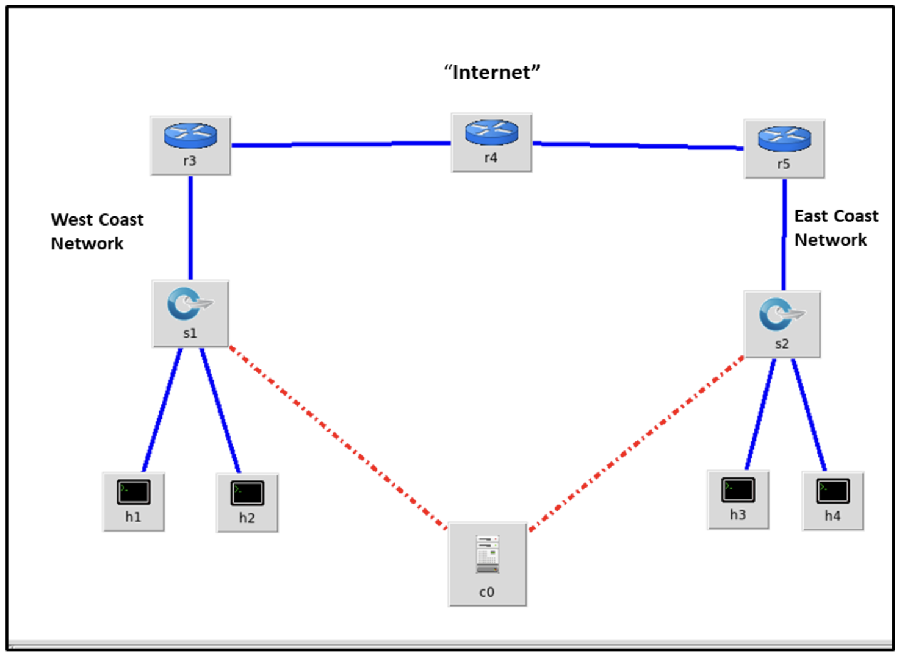
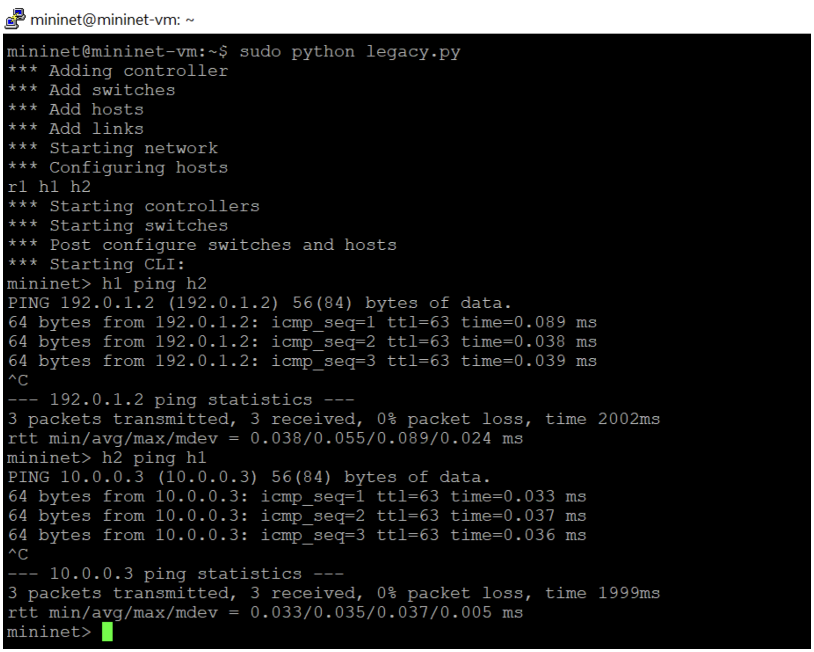

# Programming Assignment 4
## CST 311, Introduction to Computer Networks

READ INSTRUCTIONS CAREFULLY BEFORE YOU START THE ASSIGNMENT.

Assignment must be submitted electronically to [Canvas](https://csumb.instructure.com/) by 11:59 p.m. on the due date. Late assignments will not be accepted. Use the Teams on the Programming Assignment Teams document (also on Canvas under General Information > Team Information).
Select your Team leader and divide up work per the Programming Process instructions (also on Canvas under General Information > Team Information.)


The assignment requires you to submit a single python program. The naming convention of the file should be PA4_Team<your team #>.py
Put your names in the program as well. 

Your program must meet the requirements below. 
Your program must have sufficient comments to clearly explain how your code works.

This assignment is worth 100 points outlined [below](#grading-objectives)

### Subnet addressing in Mininet

In this assignment you will start with Python code that builds a 2 host network connected by a legacy router.
You will modify it such that the two hosts can send packets to each other. 
It requires that you understand subnet addressing and the function of a router.

The network built using Miniedit on a Mininet virtual machine:
`python mininet/examples/miniedit.py`



In order to run miniedit.py, you must install X server (XQuartz for MAC and XMing for Windows), if it is not already installed and setup X11 forwarding on your machine.
Instructions can be found [here](https://uisapp2.iu.edu/confluence-prd/pages/viewpage.action?pageId=280461906).


### Starter Code

Starter code can be found in the [src](src) directory.
This code generated by exporting a mininet network from miniedit it as a Level 2 Script.

Executing this code and trying a ping results in “Destination Host Unreachable”:

```shell
mininet@mininet-vm:~$ sudo python legacy_router.py
*** Adding controller
*** Add switches
*** Add hosts
*** Add links
*** Starting network
*** Configuring hosts
r1 h2 h1
*** Starting CLI:
mininet> h1 ping h2
PING 10.0.0.2 (10.0.0.2) 56(84) bytes of data.
From 10.0.0.1 icmp_seq=1 Destination Host Unreachable
From 10.0.0.1 icmp_seq=2 Destination Host Unreachable
From 10.0.0.1 icmp_seq=3 Destination Host Unreachable
```

Your task is to modify this program (perhaps using different IP addresses) such that the legacy router is able to forward packets between the two hosts.
You will need to understand Internet addressing, subnets, and the function of a router as described in the “IPv4 Addressing” Section of Kurose and Ross. 

You may also find the example Python programs in mininet/examples helpful; in particular `linuxrouter.py`.
I suggest executing that program and studying it to understand how you will need to modify `legacy_router.py`.

### Expected output



### What to include in your .zip file
- Your working`legacy_router.py` code.
- Minutes of the 3 meetings.
- A pdf file containing
  - Screenshots of the working `legacy_router.py`.
  - Network sketches as asked in the first two grading objectives
  - Answer the questions from the grading objective 7.

### Grading Objectives

- [ ] 1. (5 points) Network design of the script given in this document and show, in the diagram - what is missing/incorrect?
- [ ] 2. (5 points) Correct Network Design which allows h1 to ping h2 and for h2 to be able to ping h1. Draw and submit the network design in pdf format with IPs of all interfaces labelled. Also label the hosts as h1 and h2 and the switch as S/R.
- [ ] 3. (5 points) Screen capture of the program that runs with no Python errors.

- [ ] 4. (5 points) Screen capture of successful ‘ h1 ping h2 ’ at the minnet> prompt.
- [ ] 5. (5 points) Screen capture of successful ‘ h2 ping h1 ’ at the minnet> prompt.
- [ ] 6. (5 points) Your modified legacy_router.py program as a separate python file.
- [ ] 7. (35 points) Answers to these questions:
  - [ ] What were any interesting findings and lessons learned ?
  - [ ] Why didn’t the original program forward packets between the hosts?
  - [ ] Is the line ‘ r1.cmd('sysctl -w net.ipv4.ip_forward=1') ’ required?
  - [ ] Intentionally break your working program, e.g.: change a subnet length, IP address, or default route for a host. Explain why your change caused the network to break.
- [ ] 8. (5 points) Submission files are in order - 1 pdf document and 1 python script. Minutes of the 3 meetings. Program must be well documented.
- [ ] 9. Teamwork grade: (30 points) Each team member will grade each other teammate out of 10 points during peer evaluation. I will average all team members’ grades and scale it to get your teamwork grade out of 30 points. Note that 30% of your grade will come from your teamwork and team member evaluations.
