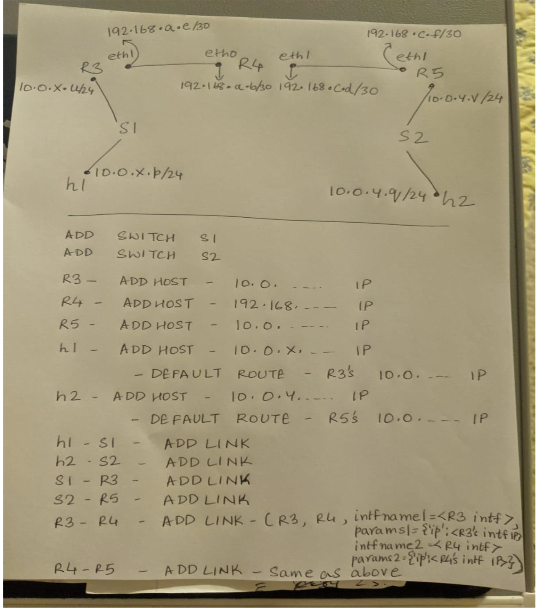

# Programming Assignment 4
## CST 311, Introduction to Computer Networks

READ INSTRUCTIONS CAREFULLY BEFORE YOU START THE ASSIGNMENT.

Assignment must be submitted electronically to [Canvas](https://csumb.instructure.com/) by 11:59 p.m. on the due date. Late assignments will not be accepted. Use the Teams on the Programming Assignment Teams document (also on Canvas under General Information > Team Information).
Select your Team leader and divide up work per the Programming Process instructions (also on Canvas under General Information > Team Information.)

The assignment requires you to submit a single python program. The naming convention of the file should be PA4_Team<your team #>.py
Put your names in the program as well. 

Your program must meet the requirements below. 
Your program must have sufficient comments to clearly explain how your code works.

This assignment is worth 330 points outlined [below](#grading-objectives)


## Task

Your task is to write a TLS-enabled chat server on a complex mininet network.
More specifically, this assignment requires you:

1. to create a network described in the paragraph below using the program MiniEdit; 
2. modify the initial Python script generated by MiniEdit so that hosts in different networks can send packets to each other; 
3. modify the Python script so that one of the hosts (h2) runs a TLS-enabled simple web server; 
4. modify the Python script so that one of the hosts (h4) runs the chat server your team developed in Programming Assignment (PA) #3, and is TLS-enabled;
5. modify the Python script so that chat client program your team developed in [PA3](../PA3) runs on both client hosts (h1 and h3), and is able to securely connect to the TLS-enabled chat server.
6. using the Certificate Authority (CA) created in Lab 6, issue TLS server certificates for the webserver described in requirement [3] and to the chat server described in requirement [4]. Use common names (CN) for both servers that indicate what type of server each is, e.g. www.webpa4.test for the web server. 
7. using Lab 6 as a guide, issue both TLS server certificates off-line in a separate script (Python or bash).  The only interactive part of the script should be a question asking for the CN of each server.  The other attributes of the Distinguished Name (DN) can be the same for both servers, and built into the script.  (The command to do this is described in Note 7 of Lab 6.  Remember also that you must modify the /etc/hosts file to include each server’s CN and IP address.)

You must submit the modified Python script and the certificate generation script per [Grading Objectives](#grading-objectives) and a document as described in [What to Submit](#what-to-submit) below.  

The initial Python script will be a Level Two script generated by MiniEdit in the Mininet VM when you create the network described in the paragraph below.  
You will have to modify this script so that all the hosts (h1, h2, h3, h4, r3, r4, and r5) can successfully ping each other, and the web server and chat applications are working correctly.  
Name this script `legacy_network.py`

### Subnet Addressing in Mininet

In this assignment you will start with Python code that builds a 2 host network connected by a legacy router.
You will modify it such that the two hosts can send packets to each other. 
It requires that you understand subnet addressing and the function of a router.

The network built using Miniedit on a Mininet virtual machine:
`python mininet/examples/miniedit.py`


In order to run miniedit.py, you must install X server (XQuartz for MAC and XMing for Windows), if it is not already installed and setup X11 forwarding on your machine.
Instructions can be found [here](https://uisapp2.iu.edu/confluence-prd/pages/viewpage.action?pageId=280461906).


### Starter Code

Starter code can be found in the [src](src) directory.
This code generated by exporting the mininet network shown in [Subnet Addressing in Mininet](#subnet-addressing-in-mininet) from miniedit it as a Level 2 Script.

Executing this code and trying a ping results in “Destination Host Unreachable”:

```shell
mininet@mininet-vm:~$ sudo python legacy_network.py
*** Adding controller
*** Add switches
*** Add hosts
*** Add links
*** Starting network
*** Configuring hosts
r3 r4 r5 h1 h2
*** Starting controllers
*** Starting switches
Traceback (most recent call last):
  File "legacy_network.py", line 64, in <module>
    myNetwork()
  File "legacy_network.py", line 54, in myNetwork
    net.get('s2').start([c0])
  File "build/bdist.linux-i686/egg/mininet/node.py", line 1165, in start
  File "build/bdist.linux-i686/egg/mininet/node.py", line 1166, in <genexpr>
  File "build/bdist.linux-i686/egg/mininet/node.py", line 1132, in intfOpts
  File "build/bdist.linux-i686/egg/mininet/node.py", line 1075, in isOldOVS
AttributeError: type object 'OVSSwitch' has no attribute 'OVSVersion' 
```

Your first tasks are to modify this program (perhaps using different IP addresses) so that the legacy routers can forward packets between the four hosts and each other.  
But first, you must get rid of the “build errors”.  
These errors occur because of the order that MiniEdit creates the switches and legacy routers.  
To get rid of these errors, move the two lines instantiating switches s1 and s2 ahead of the legacy router instantiations in the section of code labeled info( '*** Add switches\n')

to continue with the assignment, you will need to understand Internet addressing, subnets, and the function of a router as described in the “IPv4 Addressing” Section of Kurose and Ross (4.3.3 in 7th Edition).  There are certain rules you must follow for this assignment:

1. Hosts h1 and h2 and the router r3 interface connected to s1 will be on a 254-host network with the private IPv4 address of 10.0.x.0/24.  (You choose the value of x.)
2. Hosts h3 and h4 and the router r5 interface connected to s2 will be on a network with the private IPv4 address of 10.0.y.0/24.  (You choose the value of y.)
3. The link between router r3 and router r4 will be a 2-host network with the IPv4 address of 192.168.a.b.  (You choose the values of a and b.)  _Hint: Remember a 2-host network must also include the IP address of the network number and the broadcast address._
4. The link between router r4 and router r5 will be a 2-host network with the IPv4 address of 192.168.c.d.  (You choose the values of c and d.) 
5. The Level Two script has already inserted the commands to make r3, r4, and r5 routers.  You will have to add static routes (or static and default routes) to make this network work.  Six static routes (or six static plus default) routes are required so that all devices can ping each other  


You may also find the example Python programs in mininet/examples helpful; in particular `linuxrouter.py`.
I suggest executing that program and studying it to understand how you will need to modify `legacy_network.py`.

### What to submit
- [ ] Your working`legacy_network.py` code.
- [ ] 1 pdf document with deliberables of steps 1 through 8
- [ ] TLS chat server and TLS chat client scripts
- [ ] Minutes of the 3 meetings.
- [ ] Script that issues server certificates for web server and chat server
  - note: can be either bash or python
  
### Grading Objectives

- [ ] 1. (30 points) Correct Network design that follows the IP addressing rules for this assignment, listed above, and allows all the hosts to successfully ping each other. Draw and submit the network design in pdf format with all interfaces labelled with interface names (e.g., s1-eth1) and interface IP addresses.
- [ ] 2. (20 points) Screen capture of the program that runs with no Python errors.
- [ ] 3. (20 points) Screen capture of successful pingall at the mininet> prompt.   (5 points are given if h1, h2, h3 and h4 can successfully ping each other, but pingall is not successful.) 
- [ ] 4. (15 points) A list of lines that were changed and why
- [ ] 5. (30 points) Answers to these questions: 
  - [ ] What were any interesting findings and lessons learned?  
  - [ ] Why didn’t the original program forward packets between the hosts? 
  - [ ] Is the line ‘ r3.cmd('sysctl -w net.ipv4.ip_forward=1') ’ required? 
  - [ ] Intentionally break your working program, e.g.: change a subnet length, IP address, or default route for a host. Explain why your change caused the network to break. 
- [ ] 6. (25 points total) 
  - [ ] (15 points) Screen capture of a successful chat session between the two chat clients (15 points) 
  - [ ] (10 points) Screen capture of a Wireshark trace of the communication between a chat client and the chat server.
    - You must select the Server Hello packet, and in the packet details, expand the TLS Record Layer Server Key Exchange after expanding the Transport Layer Security.
- [ ] 7. (25 points) Screen capture of the successful wget (or curl) of the web server index file.
- [ ] 8. (20 points) Screenshot of both decrypted server (web and chat) certificates.
- [ ] 9. (40 points) Your modified legacy_network.py program as a separate python file. 
- [ ] 9. ***(30 points) Teamwork grade:***
  - Each student should fill out the [peer evaluation form](https://forms.gle/vtt31GjK9Rrerews5) for each of their teammates.  Effort will be graded based on reported student effort
    - An average of 3 or higher corresponds to full points
    - An average below 3 will be scaled between maximum points and 0
    - If you do not fill out the form you will lose half of your overall teamwork grade points

## Hints

### Suggested Process
1. Each student reads the assignment. 
2. Team meets to select the Team Lead who works with the team to assign roles, discusses the assignment together for a common understanding of the problem and what is needed and then sets up a schedule.  Roles for this assignment should include Team Lead; OS, mininet, and network setup person; Certificate Authority person, web server implementation person, chat implementation person, person who will do the software program changes and documentation on changes made; testing and debug; team lead backup. 
3. For this assignment, in lieu of writing pseudo code, the group will work together on how the program legacy_network.py works, what and where to make the changes needed and why. 
4. Team leader works with team on the plan for testing.  No test data is needed on this assignment. 
5. Make the changes needed and document each line that is changed 
6. Team works on test and debugging until pingall is successful, and TLS web server and TLS chat application are working.
7. TA may check in with Team Lead on assignment progress. 
8. Team lead collects items to turn in and submits a document with all the parts needed.  ***Important – only 1 document needs to be submitted - by the Team lead for each team. ***
10. Complete assignment before deadline. 

### Hints
1. To understand how to approach setting up the routing in this assignment, first read the short document entitled “Notes on Assigning IP addresses to Legacy Routers”. Then examine the image below, which shows some hints about how to approach this programming assignment. 


2. A PowerPoint presentation entitled “PA #4 Hints on Static Routes” gives an example how to assign static routes so that network traffic flows correctly.
3. There is a short demo video showing a non-TLS implementation of the PA4 requirements 4 and 5.  You can apply it for requirement 3 as well.  Please read the notes.
4. Sample TCP server and client scripts from Programming Assignment #1 have been modified to enable TLS connections.  There is a link in Canvas to these scripts.  Also provided is a short document entitled “TLS TCP Server and Client.”.   These scripts should help you with the TLS-enabling part of PA4 requirement 5.
5. The last hint provides information about programmatically running commands on an xterm window of a host.  This may help you with PA4 requirement 7.


